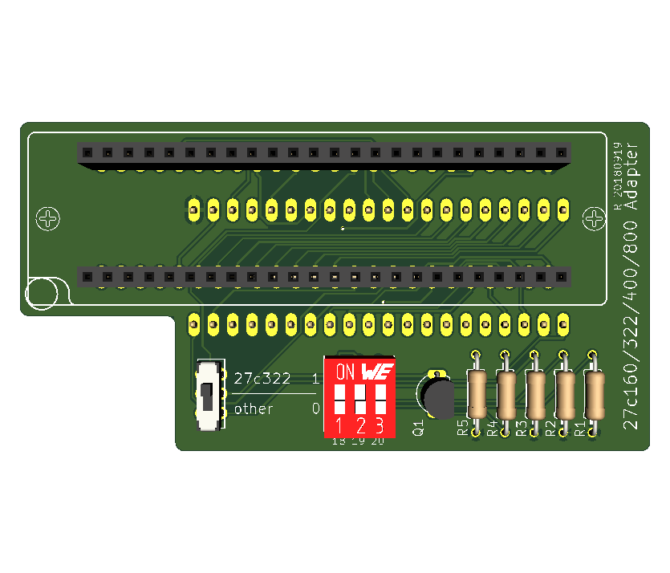
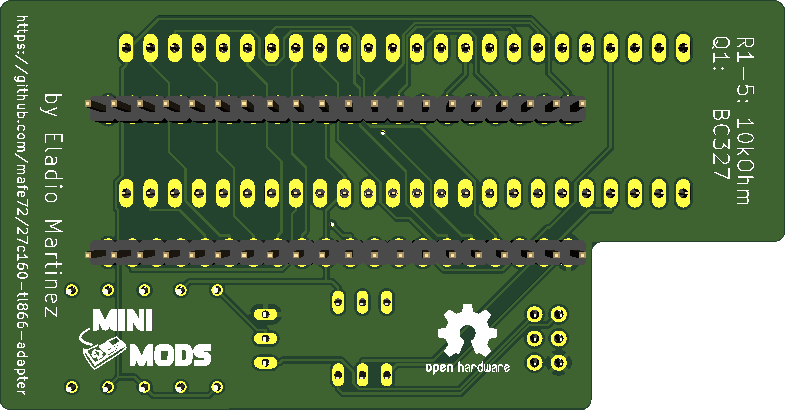
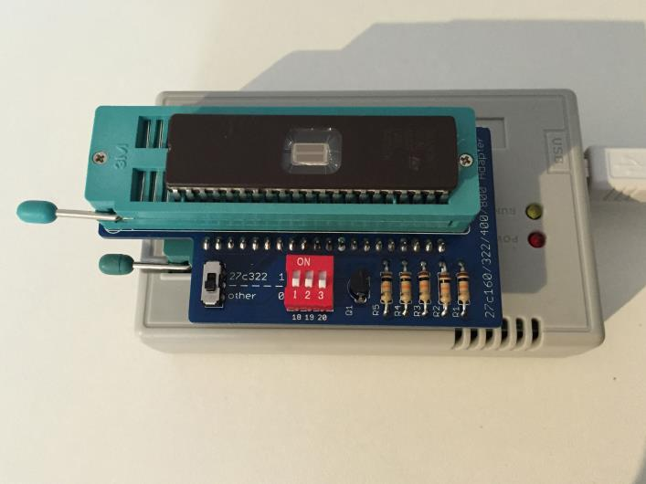
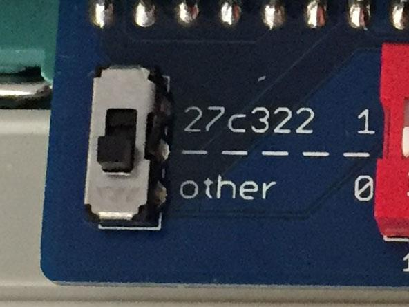
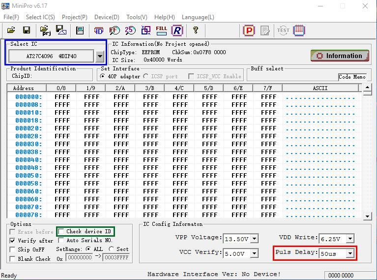
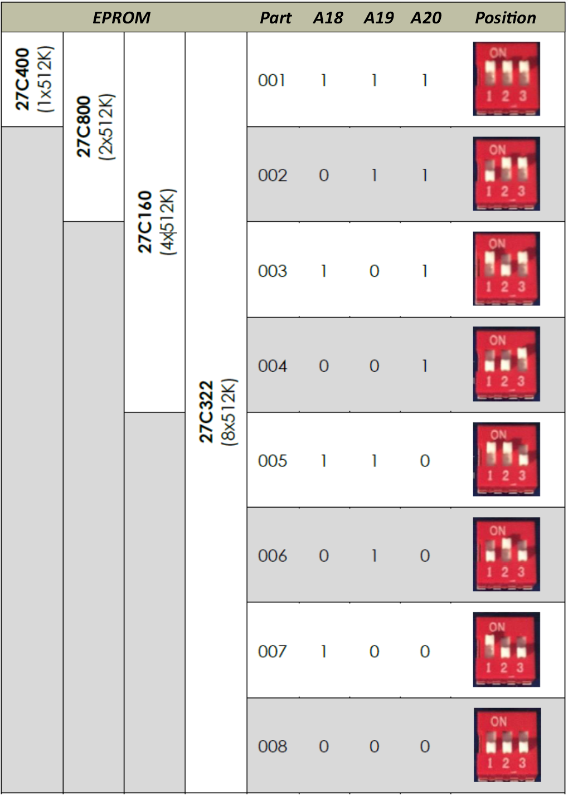

# 27C322/160/800/400 EPROM Programming Adapter Series

## Introduction

This adapter converts the pin-outs of the parts listed below (which is similar to contemporary DIP-packaged mask ROMs) to 27C4096 pin-out as supported by the readily-available and cheap TL866 series of USB programmers.

The supported EPROMs parts are:
- **27C400:** 40-pin, 4Mbit (256k x 16-bit, 512k x 8-bit)
- **27C800:** 42-pin, 8Mbit (512k x 16-bit, 1M x 8-bit)
- **27C160:** 42-pin, 16Mbit (1M x 16-bit, 2M x 8-bit)
- **27C322:** 42-pin, 32Mbit (2M x 16-bit, no 8-bit access mode)

## Design

This adapter was designed using KiCad 5.0, you can find the project files on the folder called kicad-project.

Top Side:

Bottom Side:

## Usage

Insert the programming adapter into the TL866 with the socket handles adjacent to each other. Insert the EPROM into the lowest-possible position in the adapter and with pin 1 nearest the handle.

If your are programming a 27C322 EPROMs,  move the switch to the **Position 27c322**, for 27C160 , 27C400 and 27C800 EPROMs in the **Position other**.

Launch the MiniPro software, select `AMD 27C4096 DIP40` device, deselect `Check ID` and set `Pulse Delay` to `50us`. You may also optionally reduce `VPP Voltage` to `12.50V`, depending on your EPROM's datasheet and programming success.

The EPROM can now be accessed as if it were a 27C4096 device, 512kB at a time, as configured by the DIP Switch:

- **27C400:** program all 512kB in one pass.
- **27C800:** program in 2 512kB passes.
- **27C160:** program in 4 512kB passes.
- **27C322:** program in 8 512kB passes.

Refere to the following table for DIP Switch configuration:

## Troubleshooting

If you suffer write or verify errors when programming, try these steps:

1. Make sure the EPROM is fully blank before programming it (`Device -> Blank Check`). All EPROMs available today are second-hand 'pulls' and sellers aren't always careful when erasing before resale.

2. Open and close the adapter's ZIF lever a few times, and reposition the EPROM squarely in the socket.

3. Try adjusting `VPP Voltage` between `12.50V` and `13.50V`. Subjectively I have had greater success at the higher voltage and it gives headroom for voltage losses in transferring VPP through the adapter's logic.

4. Programming errors will occur from time to time, and of course the chances increase the larger the device. It makes sense to invest in a UV eraser. These are available at low cost on Ebay for around $15-20. Most devices will be erased after 10 to 20 minutes under UV light.
