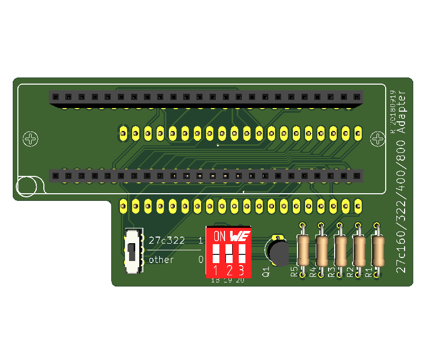
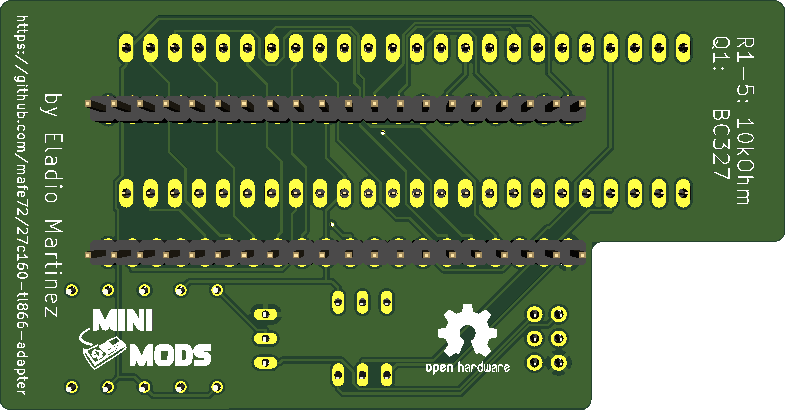
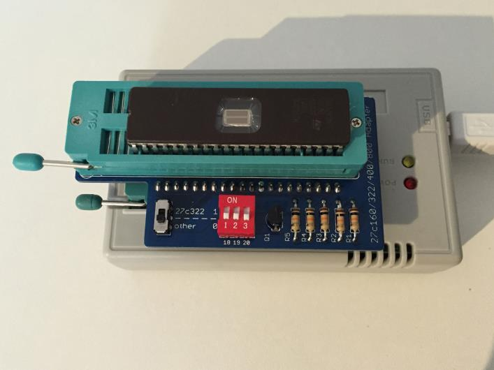
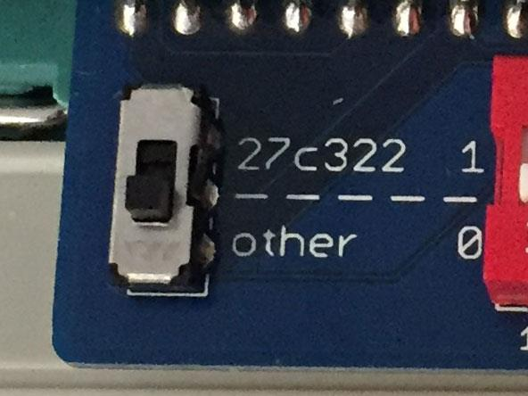
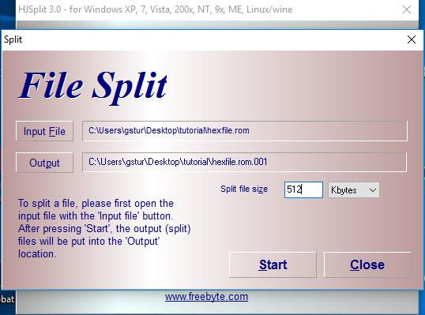
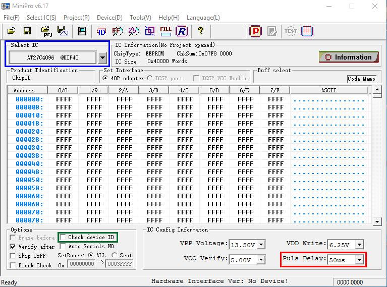
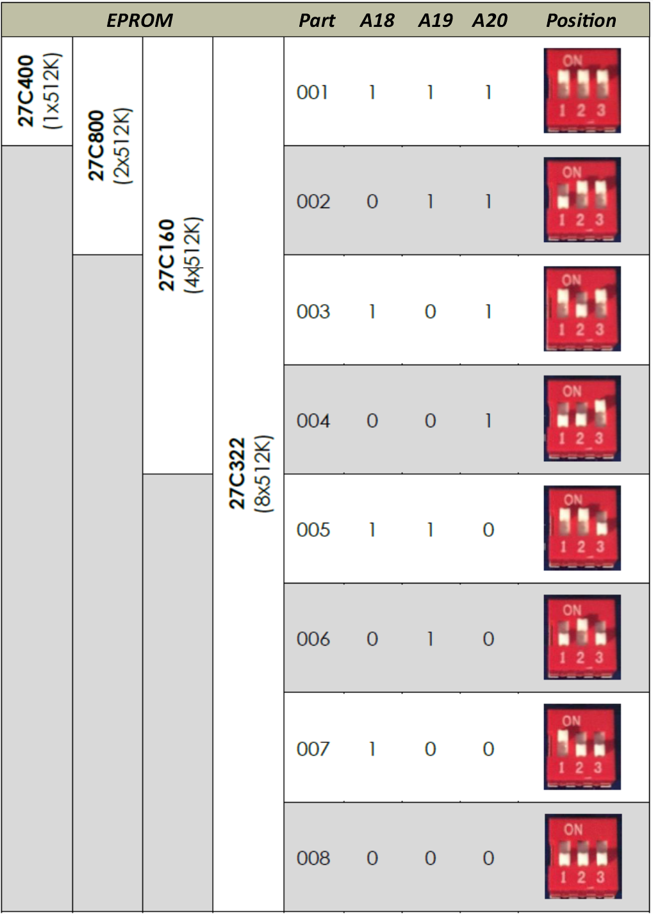
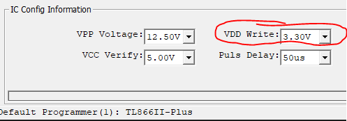
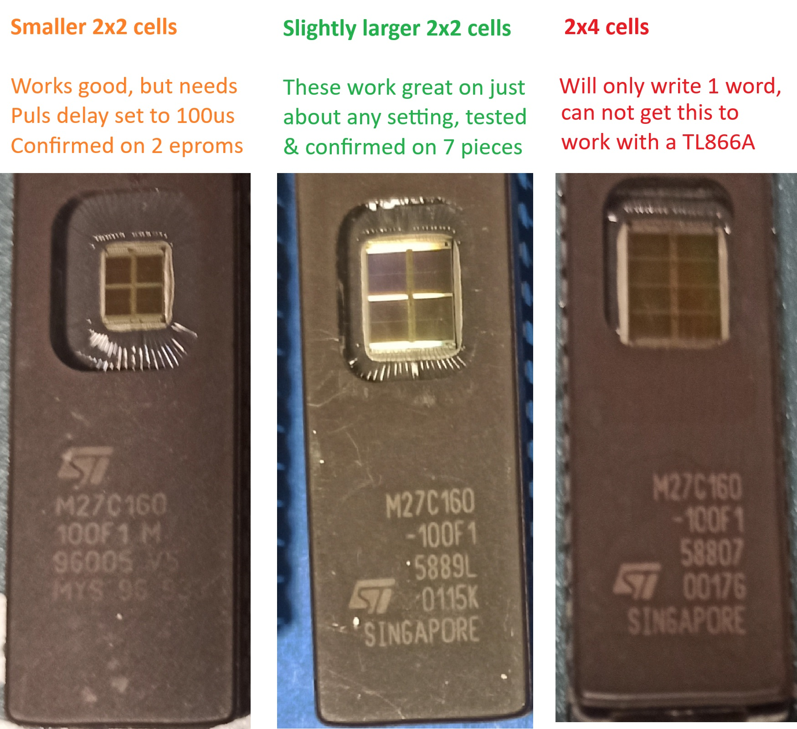

# 27C322/160/800/400 EPROM Programming Adapter Series

## Introduction

This adapter converts the pin-outs of the parts listed below (which is similar to contemporary DIP-packaged mask ROMs) to 27C4096 pin-out as supported by the readily-available and cheap TL866 series of USB programmers.

The supported EPROMs parts are:
- **27C400:** 40-pin, 4Mbit (256k x 16-bit, 512k x 8-bit)
- **27C800:** 42-pin, 8Mbit (512k x 16-bit, 1M x 8-bit)
- **27C160:** 42-pin, 16Mbit (1M x 16-bit, 2M x 8-bit)
- **27C322:** 42-pin, 32Mbit (2M x 16-bit, no 8-bit access mode)

## Design

This adapter was designed using KiCad 5.0, you can find the project files on the folder called kicad-project.

Top Side:

Bottom Side:

## Usage

Insert the programming adapter into the TL866 with the socket handles adjacent to each other. Insert the EPROM into the lowest-possible position in the adapter and with pin 1 nearest the handle.

If your are programming a 27C322 EPROMs, move the switch to the **Position 27c322**, for 27C160 , 27C400 and 27C800 EPROMs, switch must be in the **Position other**.

## Software

The following instructions describe how to write a 27c160 EPROM.

Split the source EPROM into 512Kbytes parts, in this case I use the HJSplit, however other programs can be used.

Located the output path, for this example four files of 512Kbyte size with the extension ending on ".001" - ".004".

Launch the MiniPro software, select `AMD 27C4096 DIP40` device, deselect `Check ID` and set `Pulse Delay` to `50us`. You may also optionally reduce `VPP Voltage` to `12.50V`, depending on your EPROM's datasheet and programming success.

The EPROM can now be accessed as if it were a 27C4096 device, 512kB at a time, as configured by the DIP Switch:

- **27C400:** program all 512kB in one pass.
- **27C800:** program in 2 (two) 512kB passes.
- **27C160:** program in 4 (four) 512kB passes.
- **27C322:** program in 8 (eight) 512kB passes.

Refer to the following table for DIP Switch configuration:

## Troubleshooting

If you suffer write or verify errors when programming, try these steps:

1. Make sure the EPROM is fully blank before programming it (`Device -> Blank Check`). All EPROMs available today are second-hand 'pulls'; sellers aren't always careful when erasing before resale.

2. Open and close the adapter's ZIF lever a few times, and reposition the EPROM squarely in the socket.

3. Try adjusting `VPP Voltage` between `12.50V` and `13.50V`. Subjectively, I have had greater success at the higher voltage, which gives headroom for voltage losses in transferring VPP through the adapter's logic.

4. Programming errors will occur occasionally, and of course, the chances increase the larger the device. It makes sense to invest in a UV eraser. These are available at a low cost on eBay for around $15-20. Most devices will be erased after 10 to 20 minutes under UV light.

5. [Maillouski](https://github.com/Maillouski/), reported that Xgpro v12.38 sets the default VDD Write value to 6.60V for the AT27C4096. To avoid programming issues, make sure you change this value to 3.30V.

6. [Tim aka BeepFixer](https://x.com/@beepfixer), shares his programming values for the **27C160** variants sourced from AliExpress.

   The main difference: the UV window pad configuration. call them Types A, B, and C.
    - **Type A**: 2x2 pads using only the center of the available window space 
    - **Type B**: 2x2 pads using most of the available window space 
    - **Type C**: 2x4 pads

**Testing Results**

  **Type A**: 2/10 chips needed a little TLC-a tiny tweak outside recommended settings (changing 50us 100us) made them programmable and verifiable. Just to be sure, here's the full settings used: VPP Voltage: 13.50V / VCC Verify:. 5.00V / VDD Write: 5.00V / Puls Delay: 100us. Although did have success with other voltages too, as long as the Puls Delay was at 100 and not 50us.

  **Type B**: 7/10 chips worked flawlessly- first try, recommended settings from Eladio (50us)

  **Type C**: 1/10 chip failed spectacularly. It reads and erases just fine, and can write a single word. But after the single word right it refuses to write more than that. Likely an older, stricter variant; not broken, just a silicon diva. I tried over and over again with different settings and can simply not get it to write a full batch. 

**Practical tips**

   - Always verify after programming. 
   - Try voltage differences as also mentioned in the adapter's GitHub.
   - And keep of file writes; since you will be using the adapter to write an image split into 4 sections, it is easy to write the wrong file to the wrong bank (oopsie, yes guilty of writing file 3 to bank 3 and 4 myself once). So, do verify the EPROM on the destination device!

## Hardware change log

R_20231123

* Fix EDG-03 DIP Switch's correct polarity.
* Update revision number to R_20231123
* Update Version number to 1.1

V_20180919

* Initial release.
